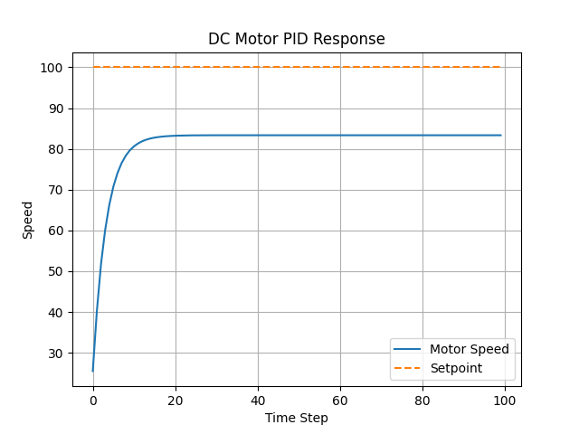

# ⚙️ DC Motor Speed Control using PID (C-programming)

## 📌 Overview

This project simulates a **DC motor speed control system** using a **PID (Proportional–Integral–Derivative) controller** implemented in C.
It demonstrates how feedback control is used in embedded systems to achieve stable and accurate motor speed.

---

## 📊 System Response



*Figure: Motor speed response showing rise time, overshoot, and settling to the desired setpoint.*

---

## 🎯 Features

* Closed-loop motor speed control
* PID controller implementation (Kp, Ki, Kd tuning)
* Anti-windup mechanism for integral control
* PWM-like control signal limiting
* CSV data logging for analysis
* Graph visualization using Python

---

## 🧠 Concepts Covered

* Feedback control systems
* PID tuning (Proportional, Integral, Derivative)
* System performance analysis:

  * Rise time
  * Overshoot
  * Settling time
  * Steady-state error
* Embedded-style modular programming in C

---

## 📁 Project Structure

```id="6g5b0s"
motor_control_project/
│── main.c        # Main simulation loop
│── motor.c       # Motor model
│── motor.h
│── pid.c         # PID controller
│── pid.h
│── plot.py       # Graph visualization
│── output.csv    # Generated data
│── graph.png     # Output graph
```

---

## ⚙️ How It Works

1. The motor model simulates speed based on input voltage.
2. PID controller calculates control signal:

   ```
   error = setpoint - actual_speed
   ```
3. Anti-windup prevents integral saturation.
4. Control signal is limited (similar to PWM in embedded systems).
5. Motor speed updates iteratively.
6. Data is stored in `output.csv` for visualization.

---

## ▶️ How to Run

### 1. Compile C Code

```id="o0rj9p"
gcc main.c motor.c pid.c -o motor
```

### 2. Run Simulation

```id="4q6jkh"
./motor
```

This generates:

```id="pmf3cc"
output.csv
```

---

## 📈 Visualization

### Install Python Library

```id="tn0v4r"
pip install matplotlib
```

### Run Plot Script

```id="v6d8i9"
python plot.py
```

This generates and displays the graph (`graph.png`).

---

## 🔧 PID Parameters

```id="kjr6zq"
Kp = 2.0
Ki = 0.5
Kd = 1.0
```

These values can be tuned to observe different system behaviors.

---

## 🚀 Improvements Implemented

* Integral anti-windup to prevent saturation
* Modular code design using header and source files
* Data logging and visualization for performance evaluation

---

## 💡 Future Enhancements

* Real-time plotting (live graph)
* Sensor noise simulation and filtering
* RTOS-based control loop
* Embedded hardware implementation (ARM/NXP boards)
* PWM duty cycle modeling

---

## 📝 Resume Description

> Simulated DC motor speed control using PID in C, implementing closed-loop feedback with anti-windup and analyzing system performance through CSV-based data logging and graphical visualization.

---

## 📌 Author

* Ashish Yadav NIT Jamshedpur

---
